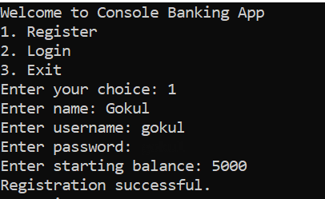
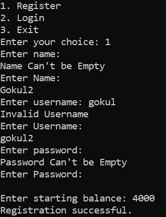
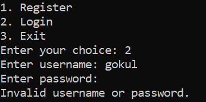
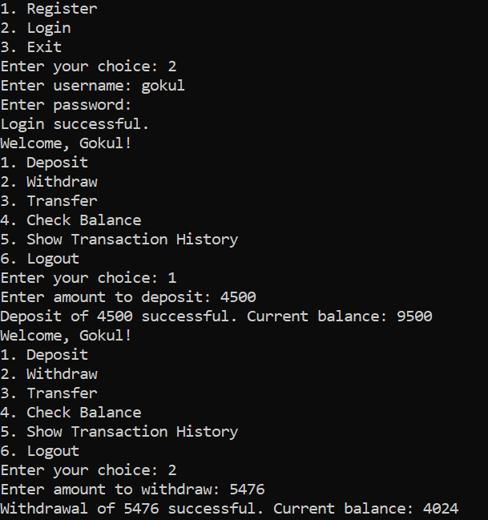
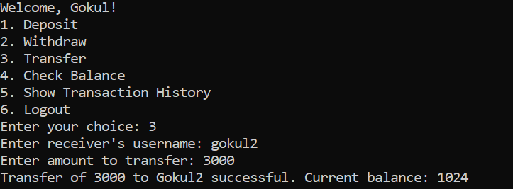
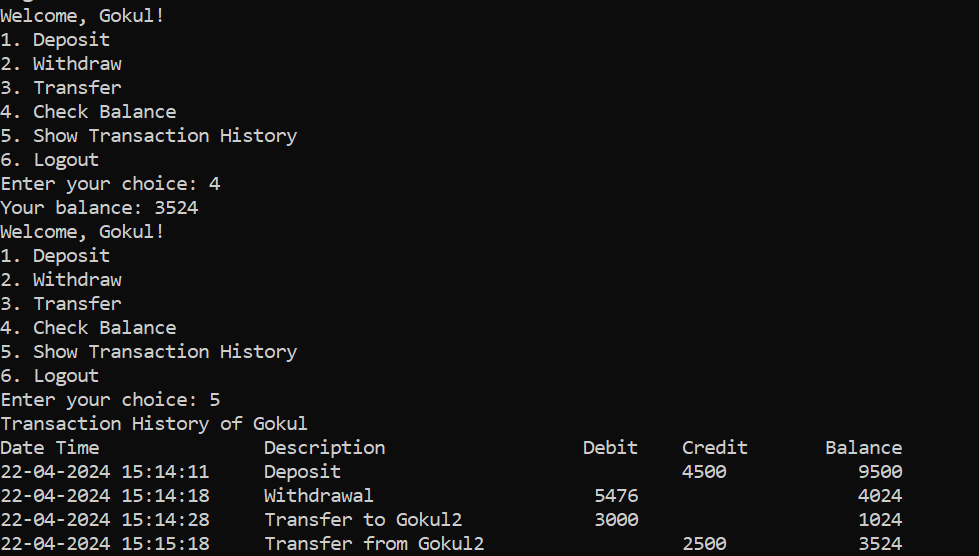

## Simple Banking Application

### Authentication Options:
- **Register (Option 1):**
  - Allows users to create a new account.
  - 
  - 
- **Login (Option 2):**
  - Enables existing users to log into their accounts.
  - 

### Banking Options:
- **Deposit:**
  - Allows users to add funds to their account.
- **Withdraw:**
  - Enables users to withdraw funds from their account.
  - 
- **Transfer:**
  - Allows users to transfer funds from their account to another account.
  - 
  - 
